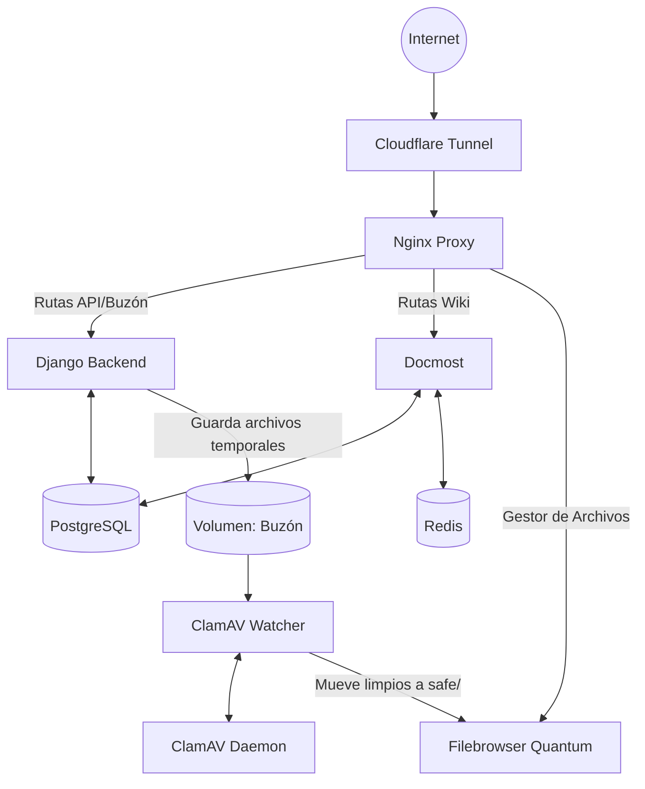

# Biblioteca Diftel SJ / Telemática Hub

Un repositorio autogestionado, altamente optimizado y seguro para los estudiantes de Ingeniería Civil Telemática (Campus San Joaquín). Este proyecto separa la distribución de contenido y la base de conocimiento colaborativa de un pipeline de subida aislado y seguro, garantizando velocidad y protección contra malware.

## 🚀 Arquitectura General

El proyecto utiliza una arquitectura de microservicios con **Docker Compose**:

- **Nginx**: Actúa como proxy inverso y servidor web para la landing page, sirviendo además los archivos estáticos y gestionando las rutas iniciales.
- **Django & PostgreSQL**: Operan gestionando la API del "Buzón Seguro", validando la identidad de los estudiantes mediante correos institucionales (PIN temporal OTP) y recibiendo los archivos. Alimentan vistas importantes de la página.
- **Docmost & Redis**: Plataforma de Wiki/Base de Conocimientos colaborativa, reemplazando antiguos generadores estáticos, apoyado por Redis para caché y tareas en segundo plano.
- **Filebrowser Quantum**: Interfaz moderna para la exploración y gestión web de los archivos en el servidor (`/srv/data/recursos` y archivos seguros).
- **ClamAV & Watcher**: Un motor antivirus oficial y un microservicio en Python que monitorea en tiempo real las subidas temporales al buzón, escaneando, aislando amenazas y aprobando archivos limpios.
- **Cloudflared**: Túnel seguro hacia la web.

### Diagrama de Infraestructura



## 🗺️ Vistas de la Página Principal

- **Proyectos**: Catálogo de proyectos estudiantiles y de la carrera.
- **Talleres Telemáticos**: Información y recursos sobre talleres impartidos en la carrera.
- **Comunidad Telemática**: Espacio centralizado para links, redes y organización de la comunidad.
- **Buzón Seguro**: Herramienta de subida autenticada.

## 🛠️ Flujo de Trabajo y Contribución

###  Aportar Material (El Buzón Seguro)
Cualquier estudiante puede aportar apuntes y recursos valiosos:
1. **Subida Autenticada:** Sube tu material en la vista del Buzón, validando tu identidad con tu correo institucional.
2. **Escaneo Antivirus Automático:** Django recibe el archivo. El servicio `telematica-watcher` lo detecta y lo escanea en tiempo real a través de ClamAV.
3. **Aprobación:** Si el archivo está limpio, se aprueba y queda disponible en Filebrowser para ser enlazado en Docmost.

## ⚠️ Deuda Técnica Existente

Actualmente el proyecto cuenta con ciertos puntos de mejora técnica (Tech Debt) a considerar para futuros PRs:
- **Falta de Tests Automatizados:** Ausencia de pruebas unitarias robustas para la validación OTP y el Watcher.
- **Refactorizaciones Pendientes:** Algunas vistas en Django y componentes del frontend acoplados podrían requerir modularización.

## ⚙️ Despliegue (Para Administradores)

1. Clona el repositorio y configura `.env`.
2. Levanta la infraestructura:
   ```bash
   docker compose up -d --build
   ```
   *(Nota: ClamAV puede tardar unos minutos en iniciar por completo la primera vez).*
