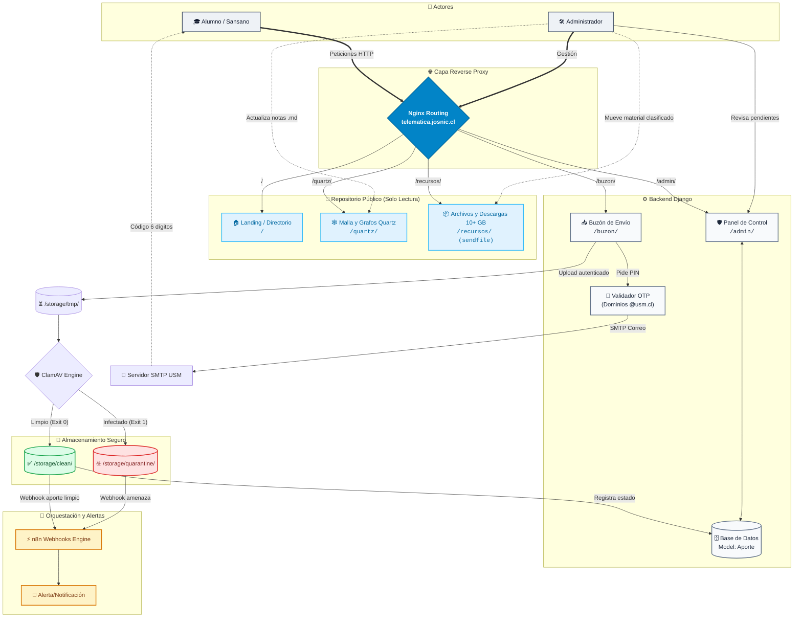

## Mermaid Diagram

```mermaid
flowchart TD
    %% ==========================================
    %% 1. USUARIOS Y ENTRADA
    %% ==========================================
    subgraph G_Clients ["👥 Actores"]
        Estudiante["🎓 Alumno / Sansano"]
        Admin["🛠️ Administrador"]
    end

    subgraph G_Gateway ["🌐 Capa Reverse Proxy"]
        Nginx{"Nginx Routing<br/>telematica.josnic.cl"}
    end

    Estudiante ==>|Peticiones HTTP| Nginx
    Admin ==>|Gestión| Nginx

    %% ==========================================
    %% 2. SERVICIOS DE CONSULTA PÚBLICA (SOLO LECTURA)
    %% ==========================================
    subgraph G_Public ["📖 Repositorio Público (Solo Lectura)"]
        Landing["🏠 Landing / Directorio<br/><code>/</code>"]
        Quartz["🕸️ Malla y Grafos Quartz<br/><code>/quartz/</code>"]
        StaticFiles["📦 Archivos y Descargas 10+ GB<br/><code>/recursos/ (sendfile)</code>"]
    end

    Nginx -->|/| Landing
    Nginx -->|/quartz/| Quartz
    Nginx -->|/recursos/| StaticFiles

    %% ==========================================
    %% 3. PIPELINE DE APORTES (DJANGO + SEGURIDAD)
    %% ==========================================
    subgraph G_App ["⚙️ Backend Django"]
        FormBuzon["📥 Buzón de Envío<br/><code>/buzon/</code>"]
        AuthOTP["🔑 Validador OTP<br/>(Dominios @usm.cl)"]
        DjangoAdmin["🛡️ Panel de Control<br/><code>/admin/</code>"]
        DB[(🗄️ Base de Datos<br/>Model: Aporte)]
    end

    Nginx -->|/buzon/| FormBuzon
    Nginx -->|/admin/| DjangoAdmin

    %% Flujo de Verificación OTP
    FormBuzon -->|Pide PIN| AuthOTP
    AuthOTP -->|SMTP Correo| MailSvc["📧 Servidor SMTP USM"]
    MailSvc -.->|Código 6 dígitos| Estudiante

    %% Subida y Escaneo
    FormBuzon -->|Upload autenticado| DirTmp[("⏳ /storage/tmp/")]
    DirTmp --> ScanNode{"🛡️ ClamAV Engine"}

    %% ==========================================
    %% 4. SEGURIDAD, ALMACÉN Y ALERTAS
    %% ==========================================
    subgraph G_Storage ["💾 Almacenamiento Seguro"]
        DirClean[("✅ /storage/clean/")]
        DirQuarantine[("☣️ /storage/quarantine/")]
    end

    subgraph G_Alerts ["🔔 Orquestación y Alertas"]
        N8N["⚡ n8n Webhooks Engine"]
        ChannelAlerts["📱 Alerta/Notificación"]
    end

    %% Decisión ClamAV
    ScanNode -- "Limpio (Exit 0)" --> DirClean
    DirClean -->|Registra estado| DB
    DirClean -->|Webhook aporte limpio| N8N

    ScanNode -- "Infectado (Exit 1)" --> DirQuarantine
    DirQuarantine -->|Webhook amenaza| N8N

    N8N --> ChannelAlerts

    %% ==========================================
    %% 5. PUBLICACIÓN POR EL ADMINISTRADOR
    %% ==========================================
    Admin -->|Revisa pendientes| DjangoAdmin
    DjangoAdmin <--> DB
    Admin -.->|Mueve material clasificado| StaticFiles
    Admin -.->|Actualiza notas .md| Quartz

    %% ==========================================
    %% CLASES Y ESTILOS (Paleta Semántica)
    %% ==========================================
    classDef client fill:#eef2f6,stroke:#475569,stroke-width:2px,color:#0f172a;
    classDef gateway fill:#0284c7,stroke:#0369a1,stroke-width:2px,color:#ffffff,font-weight:bold;
    classDef pubService fill:#e0f2fe,stroke:#38bdf8,stroke-width:2px,color:#0369a1;
    classDef djangoApp fill:#f8fafc,stroke:#64748b,stroke-width:2px,color:#1e293b;
    classDef cleanFlow fill:#dcfce7,stroke:#16a34a,stroke-width:2px,color:#14532d;
    classDef threatFlow fill:#fee2e2,stroke:#dc2626,stroke-width:2px,color:#7f1d1d;
    classDef alertFlow fill:#fef3c7,stroke:#d97706,stroke-width:2px,color:#78350f;

    class Estudiante,Admin client;
    class Nginx gateway;
    class Landing,Quartz,StaticFiles pubService;
    class FormBuzon,AuthOTP,DjangoAdmin,DB djangoApp;
    class DirClean cleanFlow;
    class DirQuarantine threatFlow;
    class N8N,ChannelAlerts alertFlow;
```
